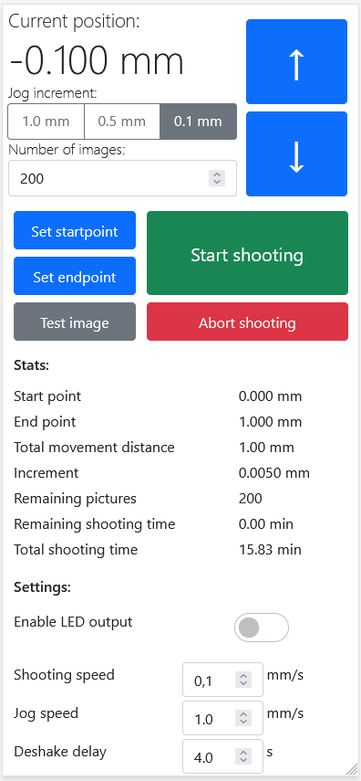

# OpenMacroRail Firmware and Web-interface
## Summary
The OpenMacroRail Firmware provides a web-interface for accurately moving a camera in small increments in order to do focus stacking. The OpenMacroRail project also consists of a [DIY-friendly circuit-board design](https://github.com/AppliedProcrastination/Motorized-Macro-Rail) that can be manufactured for around $30 if you have access to a soldering iron. The circuit board is designed for photographers with electronics skills rather than engineers with photography skills. In addition, some external hardware is also required (like a macro slider, a motor, and a camera). 

### Other parts of this project:
- [Electronics / printed circuit board](https://github.com/AppliedProcrastination/Motorized-Macro-Rail)
- [3D printable gears and PCB mount](https://www.printables.com/model/219042-motorized-camera-rail-for-macro-photography) 
- [3D printable microscope objective adapter](https://www.printables.com/model/218910-microscope-objective-adapter) (RMS Thread 160mm focal distance)
- [Canon EF/EF-S mount for the microscope adapter above](https://www.printables.com/model/218900-canon-efef-s-lens-mount-with-screw-holes)
- Section of README with links to other relevant documentation: [Various Documentation](#various-documentation)

## Various documentation:
- [NodeMCU-32S Core Development Board](https://docs.ai-thinker.com/en/esp32/boards/nodemcu_32s)
- [NodeMCU Arduino Core (Software)](https://github.com/espressif/arduino-esp32)
- [TMC2209-V1.2 manual (Motor driver module)](https://github.com/bigtreetech/BIGTREETECH-TMC2209-V1.2/blob/master/manual/TMC2209-V1.2-manual.pdf)
- [TMC2209 datasheet (chip itself)](https://www.trinamic.com/fileadmin/assets/Products/ICs_Documents/TMC2209_datasheet_rev1.07.pdf)